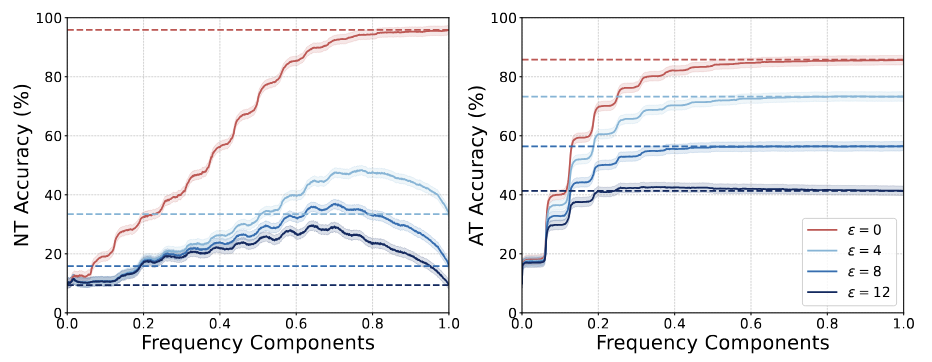
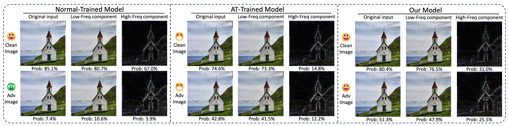
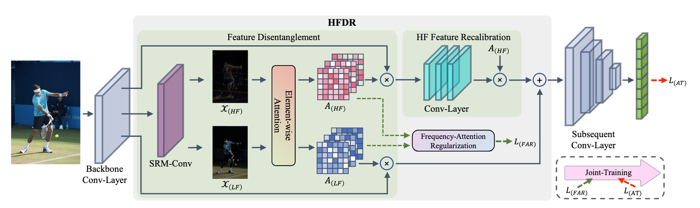

<div align="center">
  <h2 style="font-size: 36px; font-weight: bold; color: #333;">
    Mitigating Low-Frequency Bias: Feature Recalibration and Frequency Attention Regularization for Adversarial Robustness
  </h2>
</div>

<div align="center" style="margin-top: 20px;">
  <!-- License Badge -->
  
  <!-- Language Badge -->
  
</div>

This repository contains the official PyTorch implementation of our paper: "Mitigating Low-Frequency Bias: Feature Recalibration and Frequency Attention Regularization for Adversarial Robustness".

---

📈 Motivation
Despite the success of adversarial training (AT), recent studies reveal a low-frequency bias, where models increasingly rely on low-frequency components while suppressing high-frequency details, often at the expense of semantic richness and robustness.

We conduct a frequency-domain analysis to better understand this phenomenon and motivate our method.

<p align="center">
  
</p>

<p align="center" style="font-size:14px">
  <b>Figure 1:</b> Frequency component retention analysis under varying adversarial perturbation strengths ($\epsilon = 0, 4, 8, 12$). NT models rely on a broader frequency spectrum but are highly vulnerable to perturbations, especially in high-frequency regions. In contrast, AT models exhibit a low-frequency bias, leading to underutilization of informative high-frequency cues.
</p>

- For normally trained (NT) models, performance on clean images increases with more frequency information, but under adversarial attacks, high-frequency components become major vulnerabilities.
- AT models, while more robust, overly depend on low-frequency features and neglect high-frequency cues, leading to a saturation effect and lost discriminative power.

<p align="center">
  
</p>

<p align="center" style="font-size:14px">
  <b>Figure 2:</b> Comparison of post-softmax confidence across frequency components for NT, AT, and our proposed model. While NT and AT models either overly depend on or neglect high-frequency information, our method (HFDR) achieves a more balanced utilization across the spectrum, recovering meaningful confidence from high-frequency cues even under adversarial perturbations.
</p>

- NT models distribute confidence across all frequency bands, but suffer under attack.
- AT models overly suppress high-frequency components, leading to reduced confidence and underutilization.
- In contrast, our method (HFDR) successfully restores meaningful high-frequency contributions, even under adversarial conditions.

These observations motivate our High-Frequency Disentanglement and Recalibration (HFDR) module, which:

- Disentangles and enhances vulnerable high-frequency features via learnable attention,
- Recalibrates feature maps to harmonize spectral representation,
- Mitigates low-frequency bias while preserving semantic fidelity under attack.

Our method yields robust performance without sacrificing clean accuracy, and requires minimal extra overhead.

---

🧩 Method Overview

We propose HFDR (High-Frequency Disentanglement and Recalibration), a plug-and-play module designed to mitigate the low-frequency bias induced by adversarial training. HFDR explicitly disentangles frequency components and adaptively recalibrates high-frequency features to restore lost semantic information while preserving robustness.

<p align="center">
  
</p>

<p align="center" style="font-size:14px">
  <b>Figure 3:</b> Overall framework of HFDR.
</p>

---

## 🔧 Installation

To begin using HFDR, set up your environment by following the steps below:

1. **Clone the repository:**

   ```bash
   git clone https://github.com/KejiaZhang-Robust/HFDR
   cd HFDR
   ```

2. **Requirements**
   A suitable [conda](https://conda.io/) environment named `HFDR` can be created
   and activated with:

   ```
   conda env create -f environment.yaml
   conda activate HFDR
   ```

---

## 🏋️‍♂️ Training

1. Modify the training configuration:

```bash
configs_train.yml
```

2. Start training:

```bash
python train.py
```

---

## 🧪 Robustness Evaluation

1. Edit the testing configuration:

```bash
configs_test.yml
```

2. Launch evaluation:

```bash
python test_robust.py
```

---

#¥ 📖 Citation

If you find this work useful in your research, please cite our paper:

```
@article{ZHANG2026108070,
  title = {Mitigating low-frequency bias: Feature recalibration and frequency attention regularization for adversarial robustness},
  author={Zhang, Kejia and Weng, Juanjuan and Cai, Yuanzheng and Luo, Zhiming and Li, Shaozi},
  journal = {Neural Networks},
  volume = {193},
  pages = {108070},
  year = {2026},
  doi = {https://doi.org/10.1016/j.neunet.2025.108070}
}
```
